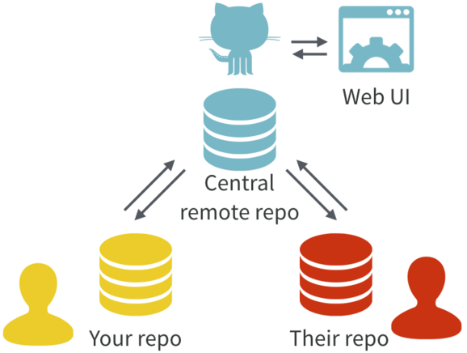
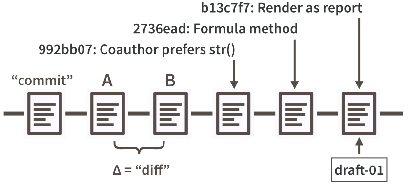
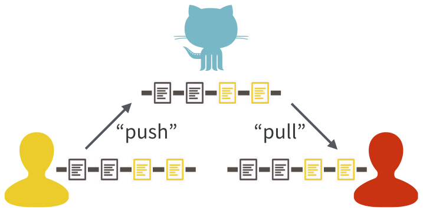
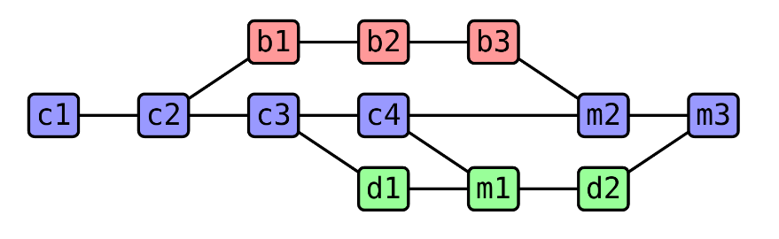
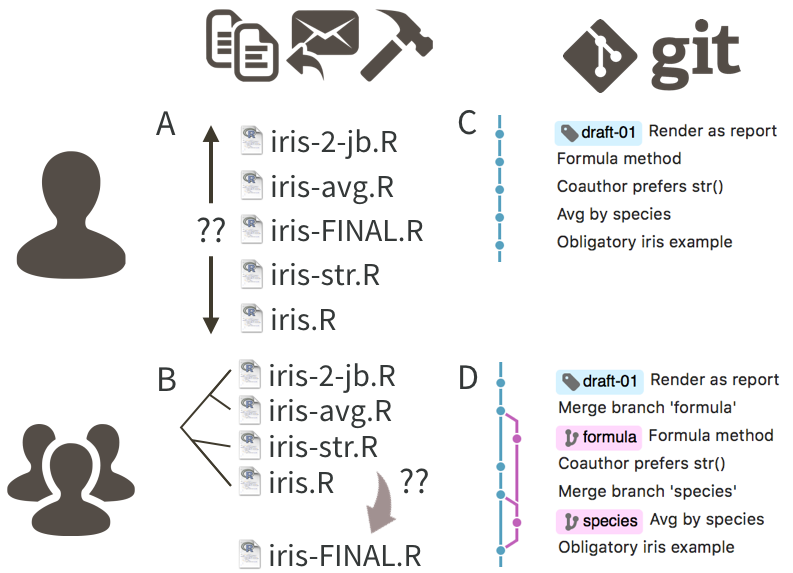
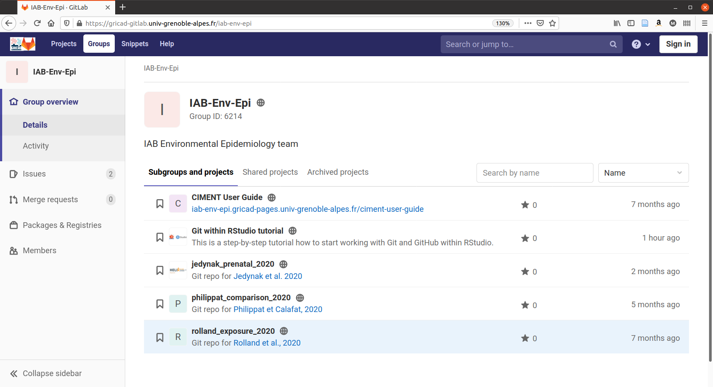
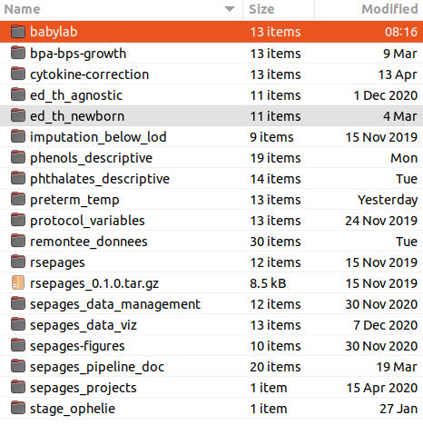
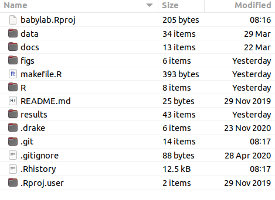
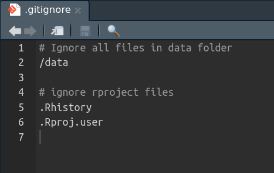
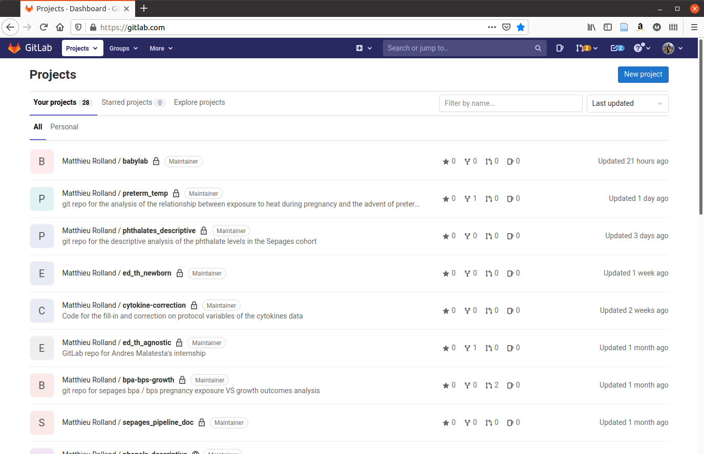

<!--
Notes for next time:
* ajouter un passage sur le R2
-->

```{r message = FALSE, warning = FALSE, echo = FALSE}
library(tidyverse)
library(see)
library(knitr)
library(kableExtra)
library(patchwork)
library(ggforce)
library(grid)
library(broom)
library(performance)
library(xaringanthemer)
```

```{r setup, include=FALSE}
options(htmltools.dir.version = FALSE)
knitr::opts_chunk$set(echo = FALSE, message = FALSE, warning = FALSE)

```

```{r xaringan-themer, include=FALSE, warning=FALSE}
style_mono_accent(
  base_color = "#f26248",
  header_font_google = google_font("Montserrat"), #Amatic SC #Neucha
  text_font_google   = google_font("Pangolin", "300", "300i"),
  code_font_google   = google_font("Fira Mono"),
  title_slide_text_color = "#f28a81"
)
```

<!-- Goal of this presentation: not to teach you git but to make you want to learn it -->
<!-- I am a biostatistician in a scientific research team, so the presentation I will make will reflect this very practical use -->

---

# Git

 <!-- Disclaimer I am not an expert, I am not a software developer, I am a statistician in a research lab, I mainly do data analysis and paper writing -->

* Version control system 
<!-- Most popular version control control system; Like the word track change option but 10 times more powerful -->
<!-- Its original purpose was to help groups of developers work collaboratively on big software projects. -->
<!-- developed by Linus Torvald the developer of Linux, developed git to be able to develop linux -->
* Repository (repo) = data, figures, reports, and... source code  <!-- Records changes made over time in a special data base called a repository -->
<!-- It enables you to see your project history and who has made change when and why -->
<!-- And if you make a mistake you can always switch your project back to an earlier state -->
* Collaboration <!-- utile même pour soi même quand on travaille avec plusieurs ordi -->
* Free and open source
* Command line tool but fully integrated in Rstudio

--

# GitHub / GitLab

* Online hosting platforms for Git-based projects
<!-- They provide a home for your Git-based projects on the internet. -->
<!-- Like DropBox but to the power 10 -->
* Remote repo  <!-- very useful even when working solo on a project -->
* User friendly web interface <!-- Especially useful when sharing code -->
* Special features
  * Issues
  * Pull-requests
  * Create website
  * etc

<!-- It allows other people to see your stuff, sync up with you, and perhaps even make changes. -->
<!-- Github is the most popular and gitlab is often used academically for historical reasons -->

---

# Architecture

<!-- A central server, several computers -->



<!-- With Git, all contributors have a copy of the repo, with all files and the full history. It is typical to stay in sync through the use of a central remote repo, such as GitHub. Hosted remotes like GitHub also provide access to the repo through a web browser. -->

Illustration from [happygitwithr](https://happygitwithr.com/)


---

# Why use Git and a hosting platform?

* Reproducibility
<!-- One of the corner stones of reproducibility. For individual researchers, Git provides a powerful way to track and compare versions, retrace errors, explore new approaches in a structured manner. For larger collaborative efforts, Git and Git hosting services make it possible for everyone to work asynchronously and merge their contributions at any time, all the while maintaining a complete authorship trail. -->
* Security <!-- online copy of your code -->
* Collaboration <!-- more and more common in modern data science -->
* Sharing/Open science <!-- for us we can easily share our publication code --> 
* Very well integrated in Rstudio <!-- which removes a lot of the initial hassle/hurdles historically associated with git -->

--

BUT

* **installation and initial configuration can be complicated** (=> [happygitwithr](https://happygitwithr.com/)) <!-- this only needs to be done once --> 
* **it is an extra layer of complexity** <!-- may not always be worth switching to git --> 

---

# Vocabulary

`repository...` set of files and folders tracked by git (aka **repo**)  
`remote.......` online backup of your repo  
`.git.........` folder that contains all the information that is necessary for your project in version control   <!-- and all the information about commits, remote repository address  It also contains a log that stores your commit history so that you can roll back to history. -->  
`.gitignore...` file that specifies intentionally untracked files to ignore

---

# Commit

<!-- to save modifications of a repo you always have to do the two following steps stage and commit, so I will talk about these two actions as if they were one because in practice that's how it is -->



<!-- Partial commit history for our iris example, highlighting diffs, commit messages,
SHAs, and tags -->

<br/>
<br/>
<br/>
<br/>

Illustration from [happygitwithr](https://happygitwithr.com/)

---

# Push - Pull


<br/>

<!-- One contributor has made two new commits and updates the master copy on
GitHub with a push. Another contributor stays up-to-date with a pull from GitHub. -->

--

**ONLY COMMITTED MODIFICATIONS ARE PUSHED!!**
<br/>
<br/>

Illustration from [happygitwithr](https://happygitwithr.com/)

---

# Vocabulary

<!-- git developed as a command line tool but you can (nearly) never use them when working in Rstudio -->

Main actions:

`init.....` create a repo  
`clone....` get a local copy of an existing repo   
`add......` take snapshots of the local repo modifications (aka staging)  
`commit...` save modifications locally  
`push.....` send local modifications to remote  
`pull.....` get collaborators' modifications on your local repo  

Additionnal vocabulary:

`hash.....` unique commit identifier  
`diff.....` difference between two versions of the same file   

---

# Branches

Allow for trial and error while maintaining a functional version



---

# Branches


---

# Vocabulary

`master branch...` clean and functional version of the code  
`merge...........` including modifications from a dev branch to the master branch  
`conflict........` happens when lines of code differ between two merged branches  

---



Illustration from [happygitwithr](https://happygitwithr.com/)

---

# A few simple rules

You should

--

* Commit frequently <!-- you should often commit small, single changes with carefully crafted commit messages that tell what the small, discrete change is.  -->

--

* Carefully write your commit comments

--

* Pull often <!-- to keep your local machine as close to the remote repository as possible -->

--

* Pull before you push  <!--Doing so will ensure that your local copy is in sync with the remote repository.  You can do this as often as you like, and should do it frequently — at least once a day if not more.-->

<br/>
<br/>
<br/>
<br/>
<br/>
<br/>
<br/>
<br/>
<br/>
<br/>

ref: [Rules for Good Git Hygiene](https://betterprogramming.pub/six-rules-for-good-git-hygiene-5006cf9e9e2)

---

# Git in IAB - Team 12

* Each engineer, researcher, post-doc, etc has their own personnal account

--

* **!!NO DATA IS TRACKED!!** ==> `/data` folder *always* in the `.gitignore` file

--

* Team account to share publication code and useful productions: 

--



---

# How I use Git

* One Rstudio project per analysis synchronised on my own GitLab account

--

* Upload code for my publications once they are online on the team's GitLab

--

* Share my code with researchers

---

# How I use Git

`~/projects`

--



---

# How I use Git

`~/projects/babylab`

--



---

# How I use Git

`~/projects/babylab/.gitignore`

--



---

# How I use Git

`www.gitlab.com`



---

# Useful links

* Great resource on all day to day uses, problems and diagnostics of git with R: https://happygitwithr.com/
* Goog presentation in French: https://www.slideshare.net/VincentGuyader/git-rstudio-vincent-guyader
* Scientific preprint publication on using git with R: https://doi.org/10.7287/peerj.preprints.3159v2
* In depth youtube tutorial on Git: https://www.youtube.com/watch?v=8JJ101D3knE
* Our teams public GitLab page: https://gricad-gitlab.univ-grenoble-alpes.fr/iab-env-epi

---

 

<!-- Transition to Pau  -->

<!-- 
Now the bad news: Git was built neither for the exact usage described here, nor for
broad usability. You will undoubtedly notice this, so it's best to know in advance. Happily,
there are many helpful tools that mediate your interactions with Git. GitHub itself is a
ne example, as is RStudio (RStudio Integrated Desktop Environment n.d.). In addition
to pointing out tools that soften Git's sharpest edges, I recommend specic habits and
attitudes that reduce frustration.
-->

<!-- Show: -->

<!-- Init, clone, stage, commit, push, pull, diff, history -->

